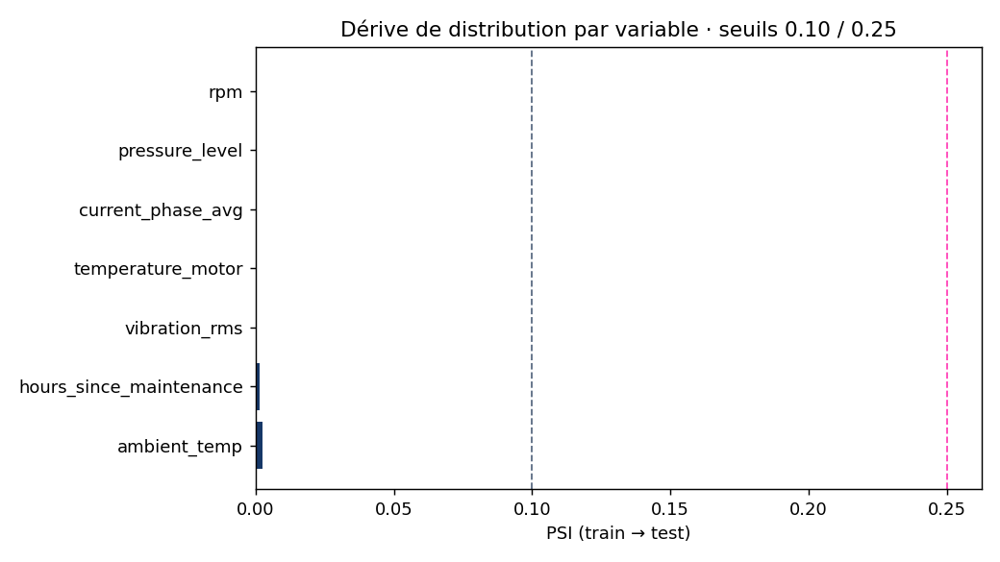

# Détection de dérive · PSI (train → test)

Référence · jeu d'entraînement. Courant · jeu de test (proxy production).
Lecture seule sur les données. Seuils · < 0.10 stable, 0.10-0.25 modérée, > 0.25 forte.

| Variable | PSI | Verdict |
|---|---|---|
| ambient_temp | 0.0026 | stable |
| hours_since_maintenance | 0.0016 | stable |
| vibration_rms | 0.0000 | stable |
| temperature_motor | 0.0000 | stable |
| current_phase_avg | 0.0000 | stable |
| pressure_level | 0.0000 | stable |
| rpm | 0.0000 | stable |

**0 variable(s)** avec PSI >= 0.10. Aucune dérive significative · le modèle reste valide.

