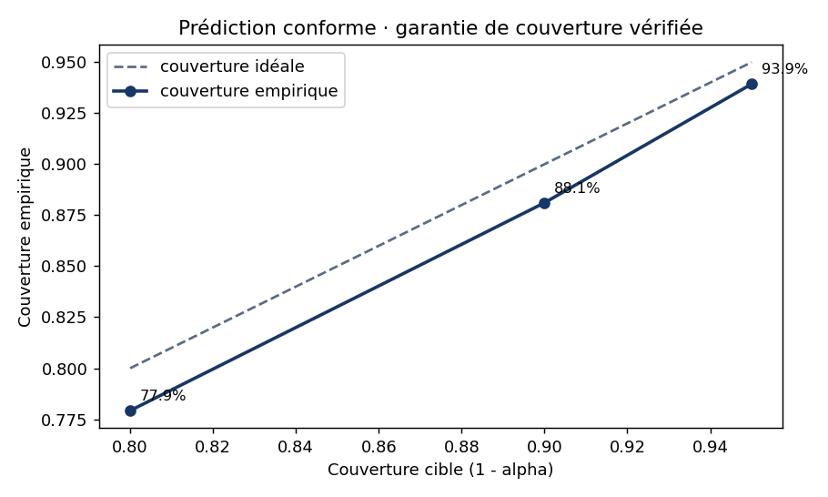

# Prédiction conforme (split-conformal LAC)

Garantie · à 1-alpha, la vraie classe est dans l'ensemble >= 1-alpha du temps.
Découpe calibration/évaluation sur le test set (données non modifiées).

| Cible (1-alpha) | Couverture empirique | Taille moy. ensemble | Seuil q |
|---|---|---|---|
| 80% | 77.9% | 0.78 | 0.026 |
| 90% | 88.1% | 0.88 | 0.086 |
| 95% | 93.9% | 0.96 | 0.311 |

## Répartition des ensembles (à 90% de couverture)

- {sain} · 1836 cas (76.3%)
- {panne} · 291 cas (12.1%)
- {} vide · 278 cas (11.6%)

