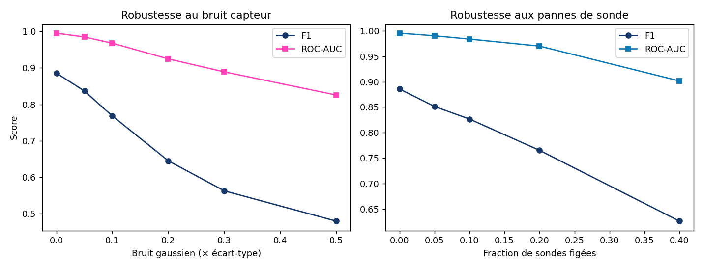

# Robustesse · bruit capteur & pannes de sonde

Perturbations appliquées en mémoire · données non modifiées.

## Bruit gaussien

| Sigma (× std) | F1 | ROC-AUC | Chute F1 |
|---|---|---|---|
| 0.00 | 0.886 | 0.995 | +0.000 |
| 0.05 | 0.837 | 0.985 | +0.049 |
| 0.10 | 0.768 | 0.968 | +0.117 |
| 0.20 | 0.645 | 0.925 | +0.241 |
| 0.30 | 0.563 | 0.889 | +0.323 |
| 0.50 | 0.480 | 0.826 | +0.406 |

## Panne de sonde (valeurs figées)

| Fraction figée | F1 | ROC-AUC |
|---|---|---|
| 0% | 0.886 | 0.995 |
| 5% | 0.851 | 0.990 |
| 10% | 0.827 | 0.984 |
| 20% | 0.765 | 0.970 |
| 40% | 0.627 | 0.902 |

